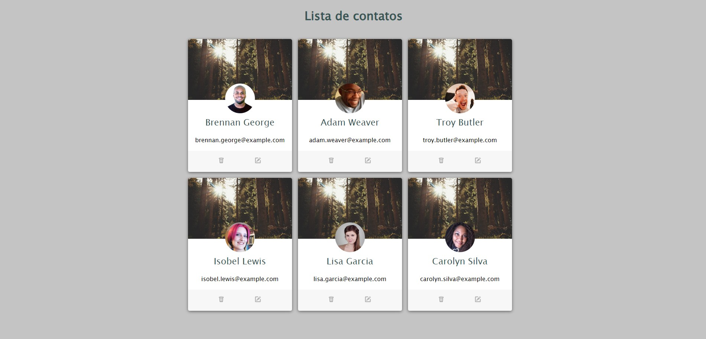

# Lista de Contatos Criativa

Este é um projeto de estudo desenvolvido com HTML5 e CSS para apresentar uma lista de contatos de forma não convencional, mas interessante. Este projeto é parte de um exercício de prática para demonstrar habilidades em desenvolvimento web.

## Descrição do Projeto

O objetivo deste projeto é criar uma lista de contatos que se destaque pela sua apresentação visual única e inovadora. Em vez de uma abordagem tradicional de tabela ou lista, este projeto utiliza técnicas avançadas de layout e design para proporcionar uma experiência memorável ao usuário.

## Funcionalidades

- Apresentação não convencional da lista de contatos.
- Layout inovador e visualmente atraente.
- Utilização de técnicas avançadas de HTML5 e CSS para criar uma experiência única.

## Imagem do projeto

